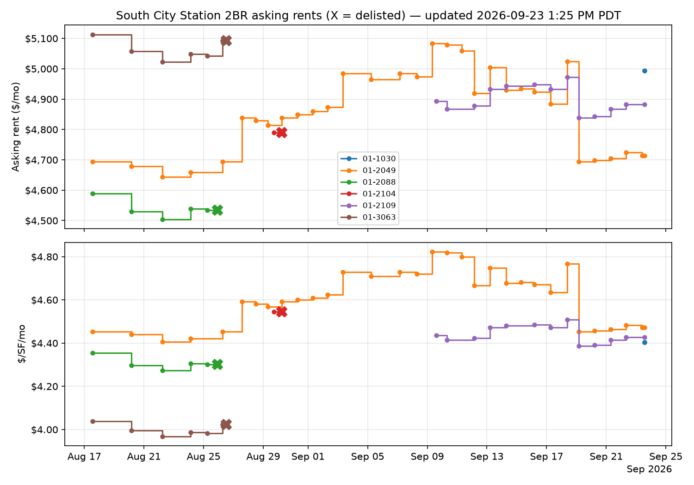

# South City Station 2BR monitor

Checks South City Station availability once an hour via GitHub Actions.
When a 2 bedroom unit shows up, it opens an issue in this repo, which
GitHub emails to you automatically. When a 2 bedroom disappears, it writes
the unit's last asking rent and time on market to a CSV. All history lives
in the `data/` folder as CSVs that render as sortable tables on github.com.

## Data sources

Primary source is the application portal at eqr-applications.com, rendered
with headless Chromium. The script loads the unit list, then visits every
unit detail page, because the list API only carries a status field
(renovating, available-now) while the exact move-in date and the per-term
pricing matrix live on the detail endpoints. The 12 month rate is selected
from that matrix; if a unit does not offer exactly 12 months, the closest
term is used and the actual term is written to lease_term_months.

Each run also cross-matches portal units to the marketing page cards on
beds, square footage, move-in date, rent, and floor, and copies over the
floorplan name, the floorplan image link, and the unit facing (parsed from
the exposure chips). Building is derived from the unit number (01-2049 is
building 01) and floor comes from the portal, so every unit carries
building, floor, facing, move-in date, and rent per square foot per month.
Alerts and run summaries show all of it, link each unit floorplan image,
and embed the community site map (auto-discovered from the marketing page,
overridable via SITE_MAP_URL, with the media gallery as fallback) so you
can place a unit by building, floor, and facing.

If the portal scrape fails for any reason, the run falls back automatically
to the equityapartments.com marketing page, which is server rendered and
scrapes reliably with plain requests, also at the 12 month rate. On a
source switch the script remaps unit identities by matching bed count,
square footage, floor, availability date, and price, so first-seen dates
and initial prices carry across and you do not get a wave of false
new/delisted events. Every log row records which source it came from.

## Setup

1. Create a GitHub repo (private is fine) and push these files, keeping the
   structure intact, including `.github/workflows/monitor.yml`.
2. Go to the Actions tab and enable workflows if prompted.
3. Run it once manually: Actions, Apartment monitor, Run workflow. The first
   run treats every currently listed 2BR as new, so you should get an issue
   listing current units within a couple of minutes. That confirms the
   pipeline end to end.
4. Verify the notification channel end to end: Actions, run the workflow
   with the "Send a test alert" box checked. Within a couple of minutes an
   issue titled [TEST] should appear in the Issues tab and land in your
   email. Alerts @mention you (MENTION_USER in the workflow env), which
   GitHub emails under Participating notifications, the most reliable
   category. If the test issue appears but no email arrives, check
   github.com/settings/notifications and enable email for Participating;
   the GitHub Mobile app also pushes these instantly. If no issue appears
   at all, open the run's "Check availability" step log; the line starting
   "GitHub issue:" prints the exact API error.
5. Optional direct email on top of the issues: add repo secrets
   `MAIL_USERNAME`, `MAIL_PASSWORD` (a Gmail app password, not your login
   password), and `MAIL_TO`. The email step skips itself when these are
   absent.

## Where the data lives

`data/availability_log.csv` gets a row every time a 2BR is listed or its
price changes: timestamp, 12 month rate, previous rate, rent per sf, unit
number, building, floorplan, square footage, floor, facing, status,
move-in date, source. When columns are added in an update, existing CSVs
are migrated in place with old rows preserved.

`data/offline_log.csv` gets a row when a 2BR leaves the market: last asking
rent, initial asking rent, price movement while listed, days on market,
first and last seen timestamps. The closest public proxy for what the unit
leased at.

`data/price_history.png` is a chart regenerated every run: asking rent on
top, rent per sf below, one step line per unit, a dot at listing and each
price change, an X where a unit was delisted. It renders at the bottom of
every alert issue and in this README below.

Unit locations are derived from the community site plan, which is committed
at data/community_map.png and embedded in every alert. Unit numbers are
floor-first (2049 = floor 2, stack 49; the 01- prefix is an EQR property
code, not a building). The stack number maps to a physical building and
wing: stacks 14-67 are the west building on the Costco Entry Dr / McLellan /
El Camino block, stacks 68-121 the east building on the BART Station Access
Rd block, 1001-1013 the standalone garages. The script carries a wing-level
map of both buildings (STACK_WINGS in monitor.py), so every alert states
building, wing, floor, and facing per unit, e.g. "West building, floor 2,
faces East/North — south courtyard cluster by the spa".
data/building_legend.json holds the building descriptions shown under
alerts and is editable.

`data/state.json` is bookkeeping for the run-to-run diff. All three are
committed back after each run, so the commit history doubles as an audit
trail. Every run also writes a table of currently listed units to the
Actions run summary page, whether or not anything changed.

## Configuration

All knobs are env vars at the top of `.github/workflows/monitor.yml`:

1. `UNITS_APP_URL` and `PROPERTY_URL`: the portal and marketing pages.
   UNITS_APP_URL accepts a comma-separated list because EliseAI sometimes
   splits one property into several building slugs (this one is
   south-city-station-2, implying a sibling may exist). Every run compares
   the marketing page's unit count against the portal's; if marketing shows
   more, the run warns that portal coverage is partial and suspends offline
   detection until the missing slug is added.
2. `SOURCE`: `auto` (portal with fallback, default), `eqr` (portal only,
   fail loudly), or `eqweb` (marketing page only, no browser needed).
3. `TARGET_TERM`: lease months whose rate is recorded. Default 12.
4. `TARGET_BEDS`: comma separated, 0 means studio. `"1,2"` tracks both.
5. `NOTIFY_EVENTS`: which events open an issue. Default `listed` only;
   add `price_change` or `delisted` for issues on those too. Everything is
   logged to CSV regardless.
6. `OFFLINE_CONFIRM_RUNS`: consecutive absent runs before a unit is
   declared offline. Default 2, so one flaky render cannot fake a lease-up.
7. The cron line is UTC. GitHub can delay scheduled runs by 10 to 30
   minutes at busy times; normal.

## Failure modes worth knowing

If the portal scrape yields nothing, the run saves the rendered page and
the captured API payloads to a downloadable artifact before falling back,
so you can inspect exactly what the app returned. If both sources fail, the
workflow fails loudly and GitHub emails you. Silent staleness is the thing
this is designed to avoid.

equityapartments.com blocks plain-requests traffic from GitHub runner IPs
(HTTP 403), so both enrichment and the fallback fetch the marketing page
through the Chromium session instead, which passes the bot check. If either
site ever starts blocking headless Chromium too, set BROWSER_HEADED to 1 in
the workflow env; the run already executes under xvfb so a headed browser
works on the runner. Setting DEBUG_PAYLOADS to 1 uploads the captured
portal JSON and rendered detail-page text as a run artifact, useful if a
field ever comes through blank and the parser needs adjusting. The source
column in the CSVs records where each row came from. The whole thing also runs on any machine with
Python if you ever want a residential IP: `pip install -r requirements.txt`,
`playwright install chromium`, `python scraper/monitor.py`.

GitHub disables cron schedules in repos with no commits for 60 days. Data
commits normally keep this alive; if the market goes completely quiet for
two months, GitHub emails first and re-enabling is one click.

## Local testing

`TEST_JSON=payload.json python scraper/monitor.py` parses a saved API
payload, `TEST_HTML=page.html python scraper/monitor.py` parses a saved
marketing page, and without a `GITHUB_TOKEN` alerts print to stdout instead
of opening issues. Useful for debugging parser changes against snapshots.

## Price history

